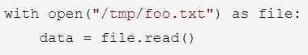
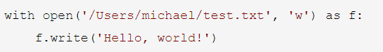

# Python字符串

###19.列举 Python 中的基本数据类型？
类型名		 | 具体类型	
------------ | ------------
数值型(number)  | int， float， bool (True/False)，complex
字符串  | str
列表	 | list
元组	 | tuple
集合	 | set
字典	 | dict

###20.如何区别可变数据类型和不可变数据类型
  类别		 | 类型名		| 特点	
------------ | ------------ | ------------
可变数据类型	 |  list，set， dict	 | 变量名指向的内存地址可以改变，对其修改是修改了当前地址内的对象。对可变数据类型使用“=”进行复制是浅拷贝，实际上相当于把两个名字不同的指针指向同一地址处的对象，修改其中一个时另外一个也会跟着改变，消除这种影响需要使用深拷贝。
不可变数据类型 | 	number，str，tuple | 	变量名指向的内存地址不可变，对其“修改”相当于重新赋值，会开辟一个新的内存地址来存放。

如何区别：
* 可变数据类型：在一个变量的内存id不变的情况下可以修改其值；
* 不可变数据类型：一个变量的值修改之后其内存id也跟着修改了，本质上不是同一个变量了。

###21.将"hello world"转换为首字母大写"Hello World"
```python
def first_capitalize(sentence:str) -> str:
	'''
	所有单词首字母大写

	将句子中的每一个单词首字母均转化为大写并返回
	:param sentence: 要转化的句子
	:return: 转化后的句子
	'''
	words = sentence.split(' ')
	for i in range(len(words)):
		words[i] = words[i].capitalize()
	return (' ').join(words)

if __name__ == '__main__':
	sentence = 'hello world'
	print(first_capitalize(sentence))
```

###22.如何检测字符串中只含有数字?
###23.将字符串"ilovechina"进行反转
###24.Python 中的字符串格式化方式你知道哪些？
###25.有一个字符串开头和末尾都有空格，比如“ adabdw ”,要求写一个函数把这个字符串的前后空格都去掉。
###26.获取字符串”123456“最后的两个字符。
###27.一个编码为 GBK 的字符串 S，要将其转成 UTF-8 编码的字符串，应如何操作？
###28. (1)s="info：xiaoZhang 33 shandong"，用正则切分字符串输出['info', 'xiaoZhang', '33', 'shandong'](2) a = "你好 中国 "，去除多余空格只留一个空格。
###29. (1)怎样将字符串转换为小写 (2)单引号、双引号、三引号的区别？


### 3.简述 with 方法打开处理文件帮我我们做了什么？
> [with方法详解](https://www.ibm.com/developerworks/cn/opensource/os-cn-pythonwith/)

• with语句适用于对资源进行访问的场合，无论是否发生异常都会进行必要的清理操作以释放资源，如文件使用后自动关闭，线程中自动进行锁的获取和释放等。
• with关键字后面跟着的语句会返回一个上下文管理器，上下文管理器在使用```__enter__()```方法进入运行时上下文，操作结束后使用```__exit__()```退出运行时上下文。
• 读文件：

• 写文件：



### 4.列出 Python 中可变数据类型和不可变数据类型，为什么？
  类别		 | 类型名		| 特点	
------------ | ------------ | ------------
可变数据类型	 |  list，set， dict	 | 变量名指向的内存地址可以改变，对其修改是修改了当前地址内的对象。对可变数据类型使用“=”进行复制，实际上相当于把两个名字不同的指针指向同一地址处的对象，修改其中一个时另外一个也会跟着改变，消除这种影响需要使用深拷贝。
不可变数据类型 | 	数值型，str，tuple | 	变量名指向的内存地址不可变，对其“修改”相当于重新赋值，会开辟一个新的内存地址来存放。

### 5.Python 获取当前日期？
```python
import datetime
datetime.datetime.now()
```

### 6.统计字符串每个单词出现的次数
```python
from collections import Counter
result = dict( Counter（string.split（））)

result = { word：string.split().count( word )  for word in string.split（）}
```

### 7.用 python 删除文件和用 linux 命令删除文件方法
```python
# python方法：
	import os
	os.remove（'demo.txt'）
# Linux方法：
	rm 'demo.txt'
```
	
### 8.写一段自定义异常代码
```python
if xxx: raise ValueError('你这个值有问题')    # 或者其他异常类型，抛出错误后就不会执行下面的语句了
else: print('很棒，没问题')
```

### 9.举例说明异常模块中 try except else finally 的相关意义
	• try：需要检测的异常代码片段
	• except：发生需要重点检查的异常类型时执行的操作
	• else：发生除了上面except中出现的异常以外其他的异常类型时执行的操作
	• finally：不管是否发生异常都会执行的代码段

### 10.遇到 bug 如何处理
	• 根据报错信息找到相应代码，一般的数据结构和算法错误一般找到就能解决；
	• 设置断点进行debug；
	• 上搜索引擎，看看人家怎么解决的类似问题；
	• 长时间解决不出来可以请教他人，别人可能迅速看出来问题而你自己看不出来，因为是你写的bug啊。。
	• 此路不通，绕道迂回。
